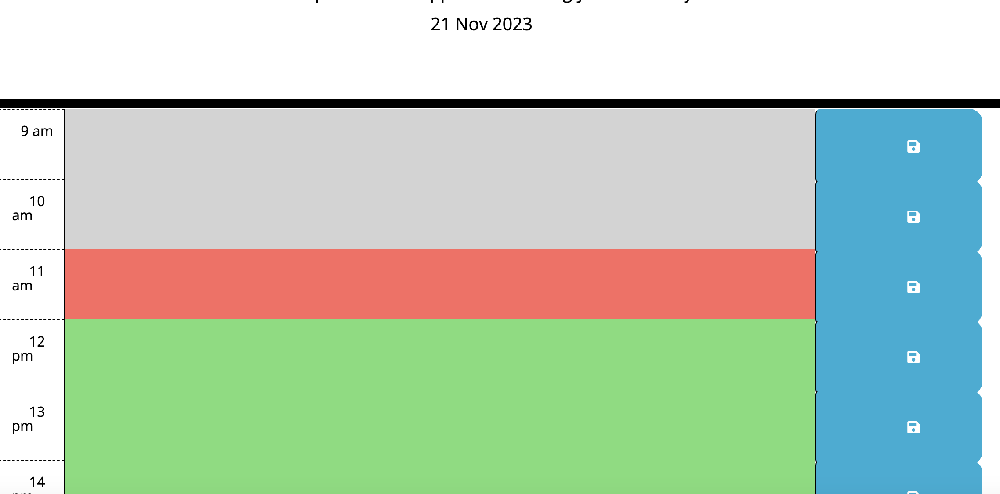

# Daily-Planner-App
This application showcases my skills utilising JavaScript in order to provide a Daily Planner App to highlight my knowledge on working with Local Storage. You can access the live website [here.](https://hamdanurfore.github.io/Daily-Planner-App/)


# Table of Contents
- [Features](#features)
- [Getting Started](#getting-started)
- [Usage](#usage)
- [Contributing](#contributing)
- [License](#license)

# Features
The acceptance criteria that this application successfully executed is as  follows:

- Display the current day at the top of the calendar when a user opens the planner.

- Present timeblocks for standard business hours when the user scrolls down.

- Color-code each timeblock based on past, present, and future when the timeblock is viewed.

- Allow a user to enter an event when they click a timeblock.

- Save the event in local storage when the save button is clicked in that timeblock.

- Persist events between refreshes of a page.

# Getting Started
To get a copy of this project up and running on your local machine, follow these steps:

Clone this repository to your local machine using git clone:
```
git clone https://github.com/hamdanurfore/Daily-Planner-App.git
```

Navigate to the project directory:

```
cd Daily-Planner-App
```

Open the index.html file in your web browser to view the webpage!

# Usage
The application should present the following:



# Contributing

I welcome contributions and feedback! If you have suggestions for improvements, bug reports, or would like to collaborate on a project, please open an issue or submit a pull request.

# License

This project is licensed under the [MIT](https://github.com/hamdanurfore/Daily-Planner-App/blob/main/LICENSE) License. You are free to use, modify, and distribute it, as long as you include the appropriate attribution and adhere to the terms of the license.

